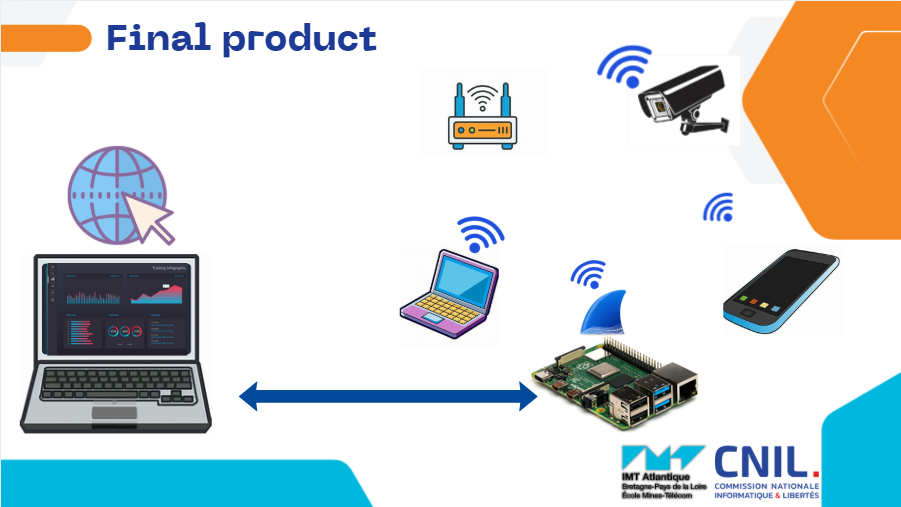

#  SniffAI (SNIFF-ML)

## Overview

**SniffAI** is an intelligent network monitoring and device detection system based on **network traffic analysis** and **Machine Learning**. The project aims to detect and identify devices connected to a network by analyzing captured network packets (PCAP files) and extracting relevant metrics, which are then processed by trained ML models.

The system is designed to work in real conditions by transforming a PC or a Raspberry Pi equipped with a Wi‑Fi card into a **Wi‑Fi access point**, acting as a router replacement capable of sniffing traffic in real time.


## Objectives

* Detect devices connected to a network
* Analyze network traffic using PCAP files
* Extract meaningful network metrics
* Store structured data in a PostgreSQL database
* Train and evaluate Machine Learning models
* Provide an interactive visualization dashboard
* Deploy the system on a Raspberry Pi


## System Architecture

```
PCAP Collection
      ↓
Feature Extraction
      ↓
PostgreSQL Database
      ↓
ML Training (RF, CNN-LSTM)
      ↓
Model Evaluation
      ↓
Streamlit Application
      ↓
Raspberry Pi Deployment
```


## Data Collection

The system starts with the collection of **network traffic data** in the form of **PCAP files**. These files can be:

* Downloaded from public datasets available online
* Captured locally using a Wi‑Fi interface in monitor mode

The captured packets are later processed to extract network-level features.


## Feature Extraction

From the PCAP files, several metrics are extracted, such as:

* IP addresses
* Protocols
* Packet sizes
* Ports
* Direction
* Time-based statistics

These features form the dataset used for training and testing the ML models.


## Database (PostgreSQL)

All extracted features are stored in a **PostgreSQL** database. This allows:

* Structured storage of network metrics
* Efficient querying
* Separation of training and testing datasets
* Scalability for large traffic volumes


## Machine Learning Models

### 🔹 Random Forest (RF)

A Random Forest classifier is trained using extracted features for fast and interpretable device detection.

### 🔹 CNN-LSTM

A hybrid **CNN + LSTM** deep learning model is implemented to:

* Capture spatial patterns in network features (CNN)
* Learn temporal dependencies in traffic flows (LSTM)

This model is particularly suitable for sequential network data.


## Testing & Evaluation

The trained models are evaluated using multiple metrics, including:

* Accuracy
* Precision
* Recall
* F1-score

The comparison between classical ML (RF) and deep learning (CNN-LSTM) highlights performance differences.


## Visualization with Streamlit

A **Streamlit** web application is developed to provide:

* Visualization of network metrics
* Display of detected devices
* Model prediction results
* Interactive exploration of captured data

Launch the application using:

```bash
streamlit run app.py
```

## 📡 Network Setup (Access Point Mode)

The system uses a PC or Raspberry Pi with a Wi‑Fi card configured as an **access point**, replacing a traditional router.

### 🔹 Activate Python Virtual Environment

```bash
source venv/bin/activate
```

### 🔹 Create Wi‑Fi Hotspot

```bash
nmcli dev wifi hotspot ifname wlo1 ssid SniffAI password 12345678
```

### 🔹 Check Network Interfaces

```bash
ip link
```

### 🔹 Enable Monitor Mode

```bash
sudo airmon-ng start wlo1
```

This configuration enables live traffic sniffing.


## Raspberry Pi Deployment

SniffAI is deployed on a **Raspberry Pi**, making it:

* Portable
* Low-cost
* Suitable for real-world experiments

The Raspberry Pi acts as:

* A Wi‑Fi access point
* A packet sniffer
* A lightweight ML inference device


## Installation

### Prerequisites

* Python 3.12+
* PostgreSQL
* Wi‑Fi card supporting monitor mode
* Linux-based OS (recommended)


## Contribution

Contributions are welcome! You can help by:

* Improving feature extraction
* Adding new ML models
* Optimizing performance
* Enhancing Streamlit UI
* Writing documentation or tests


##  Authors

Developed by FISE A2 students at IMT Atlantique as part of a Machine Learning and Network Security project proposed by the CNIL.


<p align="center">
  
</p>
